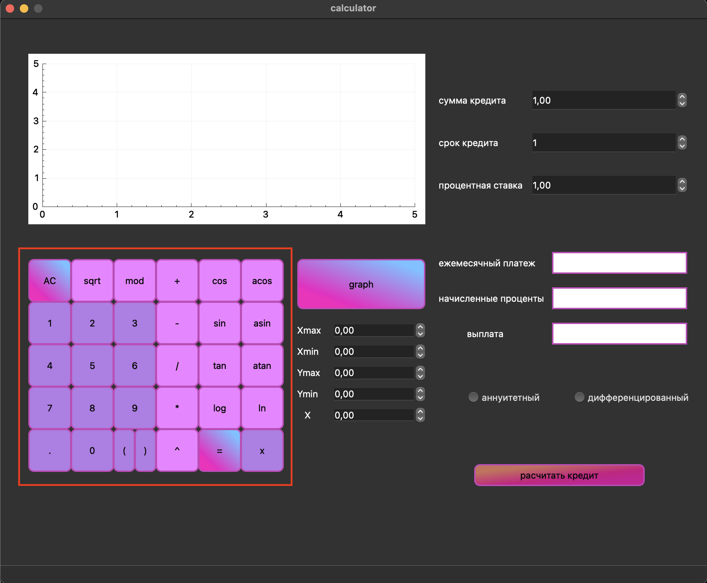
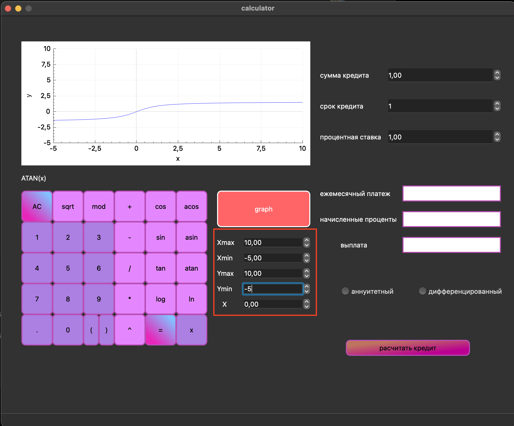
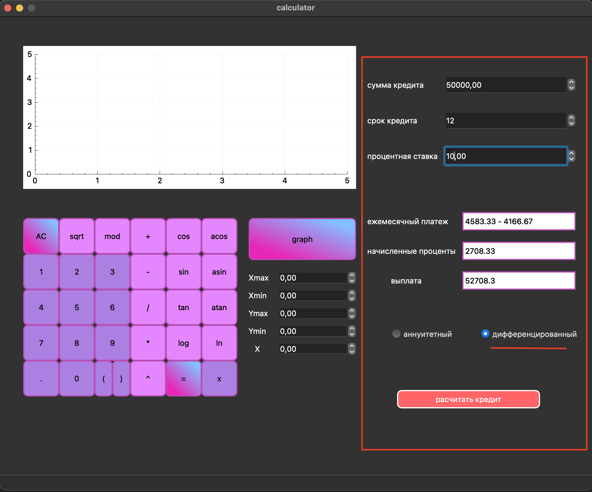

# SmartCalc v1.0  

## Основная часть калькулятора  

  
- Включающая в себя арифметические операторы и тригонометрические функции;   
- Вычисление производится после полного ввода вычисляемого выражения и нажатия на символ = .  

## График  
  
- Стандартный вывод графиков. По умолчанию Xmin = -10.0, Xmax = 10.0, Ymin = -10.0, Ymax = 10.0.  

  
- С помощью Double Spin Box можно менять маштаб  

## Кредитный калькулятор   

- Вход: общая сумма кредита, срок, процентная ставка, тип (аннуитетный, дифференцированный);  
- Выход: ежемесячный платеж, переплата по кредиту, общая выплата.  

  
- Расчет аннуитетного типа ежемесячного платежа  

  
- Расчет дифференцированного типа ежемесячного платежа  

